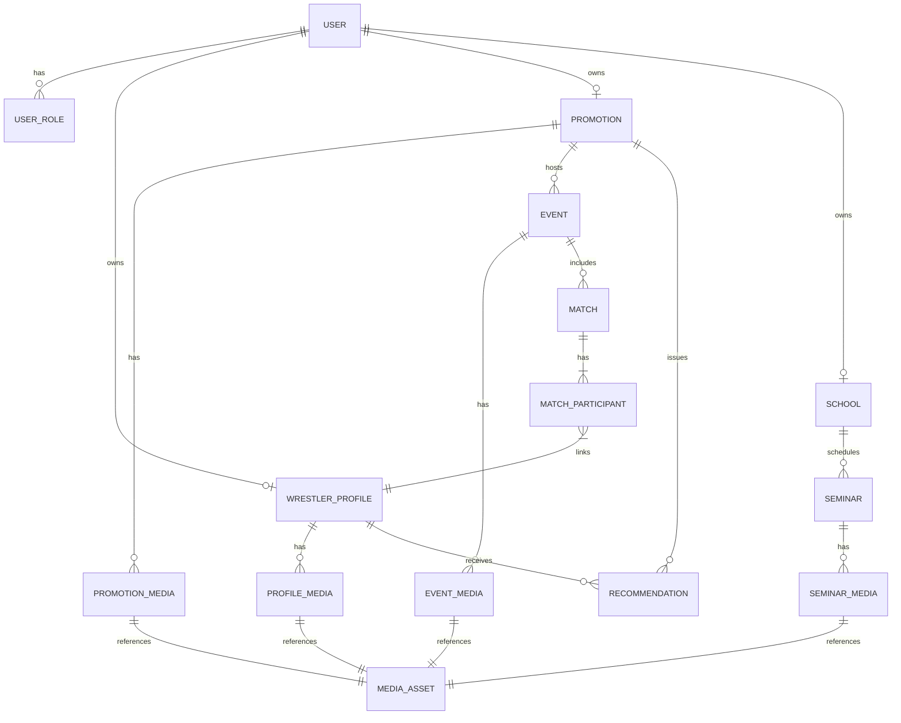

# WrestleConnect Product Specification

## Vision
WrestleConnect connects independent professional wrestlers, promotions, and schools in a modern marketplace-style platform. The product should feel trustworthy, community-driven, and visually sharp—leaning into bold imagery, strong typography, and card-based layouts that highlight talent and events at a glance.

## Target Personas
- **Independent Wrestler** – Needs a living resume with media, bookings, and promotion references.
- **Promotion Booker/Owner** – Wants quick vetting of talent, history with the promotion, and ability to manage upcoming cards quickly.
- **Training School Operator** – Showcases their program, seminars, and notable graduates.
- **Fan / Industry Observer (later phase)** – Passive viewing of public profiles, discovering upcoming events.

## Core Use Cases
1. Wrestlers create and manage a dynamic profile page.
2. Promotions manage an organization page with team, events, and recommended talent.
3. Promotions verify past bookings and leave a recommendation rating for wrestlers.
4. Schools manage their institution page and promote classes/seminars.
5. Everyone tracks upcoming events, rosters, and media through a unified experience.

## Information Architecture

### High-Level Entities
- **User Account** – Auth wrapper for any actor (wrestler, promotion admin, school admin, or staff).
- **Wrestler Profile** – Biographical info, media, accolades, availability, references.
- **Promotion** – Organization details, match history, roster, events.
- **Event** – Past or upcoming shows, cards, matchups, participants, media.
- **Recommendation** – Promotion-backed verification with qualitative and quantitative rating.
- **School** – Gym/academy profile, staff, seminars, alumni.
- **Seminar/Training Session** – Events under a school.
- **Media Asset** – Uploaded photos, linked videos.

### Relationships
- A `User` can own a `WrestlerProfile`, `Promotion`, or `School` (or multiple via role assignments).
- `Promotion` has many `Events`, many `Recommendation` entries, and many `PromotionMember` relationships referencing `WrestlerProfile`.
- `Event` has many `Matches` with participating wrestlers; each match can link highlight media.
- `Recommendation` belongs to a `Promotion` and `WrestlerProfile`, with fields for status (`verified`, `pending`, `declined`) and rating.
- `School` has many `Seminars` and optional alumni (references to `WrestlerProfile`).
- `MediaAsset` belongs to either `WrestlerProfile`, `Promotion`, `Event`, or `Match`.

## Feature Breakdown

### Authentication & Onboarding
- Email/password, with optional social sign-in (Google, Apple) in later phases.
- Role selection during onboarding (wrestler, promotion, school). Users may request additional roles later.
- Admin verification flow for promotions and schools to prevent spoofing.

### Profiles
- **Wrestler Profile**
  - Hero section: name, stage name, location, weight class, style tags.
  - Highlights: years active, notable accomplishments, championship belts.
  - Media gallery: photo uploads (with moderation) and embedded YouTube/Vimeo matches.
  - Availability calendar snippet or open dates.
  - References carousel: recommendations from promotions.
- **Promotion Page**
  - Hero banner with branding, location, contact, socials.
  - Roster section showcasing verified wrestlers they've booked.
  - Event timeline with links to each event detail page.
  - Testimonials/ratings from talent (future roadmap).
- **School Page**
  - Hero imagery, coaches, facility details.
  - Upcoming seminars/workshops with registration CTAs.
  - Success stories or notable alumni list.

### Events & Matches
- Promotions create events with metadata (date, venue, ticket URL).
- Each event can have a card builder to add matches, participants, outcomes, and match media.
- Wrestlers tagged in events automatically list them on their profile history.
- After events, promotions can add recaps, photos, and embedded videos.

### Recommendations System
- Promotions can submit verification for wrestlers they’ve booked.
- Recommendation includes rating (1–5), tags (punctual, professional, crowd favorite), and optional testimonial text.
- Wrestler receives notification to approve visibility (or dispute).
- Aggregate rating displayed on wrestler profile with breakdown.

### Search & Discovery
- Global search bar filtering wrestlers, promotions, schools, events.
- Tag-based filters (styles: technical, deathmatch, lucha, etc.).
- Location-based discovery (nearby promotions/schools).

### Media Handling
- Image uploads stored in object storage (e.g., AWS S3, GCS, or Supabase Storage) with responsive variants.
- Videos handled via external links (YouTube/Vimeo) with preview thumbnails.
- Admin moderation queue for flagged content.

### Notifications
- Email + in-app notifications for verification requests, new recommendations, event collaboration invites.

### Admin & Moderation
- Internal dashboard for platform admins to review new promotions/schools, handle reported content, and manage featured profiles.

## UX & Visual Direction
- **Brand Keywords:** Bold, authentic, electric, reliable.
- **Color Palette:** Deep charcoal base, accents of crimson (#D72638), electric blue (#2680C2), and neutral off-white backgrounds.
- **Typography:** Headings in a modern professional sans (Manrope), body text in a clean sans (Inter), with Space Grotesk available for numeric accents.
- **Layout:** Card-based sections, large hero imagery, responsive grid (12-column). Ensure accessible contrast and readability.
- **Interactive Elements:** Hover states, micro-animations on cards, skeleton loaders for profile data fetching.
- **Responsive Strategy:** Mobile-first with progressive enhancement for desktop (sticky sidebars, split views for roster vs. events).

## Technical Architecture (Recommended)
- **Frontend:** Next.js (App Router) with TypeScript, Tailwind CSS (or CSS-in-JS) for rapid iteration, React Query/TanStack Query for data fetching.
- **Backend:** Supabase (Postgres + Auth + Storage) or a custom Node.js/NestJS service if self-hosting control is needed. Consider GraphQL (Nexus/Hasura) if complex querying expected.
- **Media Storage:** Supabase Storage or AWS S3 with CDN (CloudFront/Cloudflare) for performant file delivery.
- **Search:** Start with Postgres full-text search; evaluate Algolia/Meilisearch as dataset grows.
- **Infrastructure:** Vercel for frontend deployment, Supabase managed backend for MVP. Future scale may require dedicated infra (AWS/GCP).
- **CI/CD:** GitHub Actions for lint/test/build. Preview deployments via Vercel.

## Data Model (Initial)

### Table Sketch
- `users`: id, email, hashed_password, created_at, last_login.
- `roles`: id, name (`wrestler`, `promotion_admin`, `school_admin`, `platform_admin`).
- `user_roles`: user_id, role_id.
- `wrestler_profiles`: id, user_id, ring_name, real_name, location, weight, height, styles (jsonb), bio, availability_notes, socials (jsonb), status.
- `promotion`: id, user_id, name, location, founded_year, socials (jsonb), description, website_url, logo_url, banner_url, verified_at.
- `promotion_roster`: promotion_id, wrestler_id, relationship_status (active, alumni), first_booked_at.
- `events`: id, promotion_id, title, date, venue, city, state, ticket_url, status, description.
- `matches`: id, event_id, match_type, title, outcome_summary, video_url.
- `match_participants`: match_id, wrestler_id, is_winner.
- `recommendations`: id, promotion_id, wrestler_id, rating, tags (jsonb), testimonial, status, submitted_at, published_at.
- `schools`: id, user_id, name, location, description, coaches (jsonb), contact_email, website_url, banner_url, verified_at.
- `seminars`: id, school_id, title, start_at, end_at, price, registration_url, description.
- `media_assets`: id, owner_type, owner_id, type (`image`, `video_link`), storage_path, video_url, caption, order_index.
- `notifications`: id, user_id, type, payload (jsonb), read_at.
- `audit_logs`: id, actor_id, action, entity_type, entity_id, payload, created_at.

## Privacy & Safety Considerations
- Allow wrestlers to hide real name by default; require manual opt-in for sharing personal contact info.
- Content moderation workflow for reported media or testimonials (soft delete with audit trail).
- Rate limiting on recommendation submissions and profile edits to prevent abuse.

## Accessibility & Localization
- WCAG 2.1 AA compliance (keyboard navigation, high contrast, alt text required on images).
- Prepare for localization by storing copy in translation files and using numeric formats that respect locale.

## Analytics & KPI Targets
- Track profile views, event page engagement, seminar registrations.
- Weekly active wrestlers/promotions.
- Recommendation conversion rate (submitted → approved → published).
- Growth metrics by region and style tags.

## Open Questions
- Should fans be able to create accounts at launch or remain read-only?
- Do promotions need payment processing (e.g., selling tickets or paying talent)?
- Should there be messaging/inbox between promotions and wrestlers, or rely on external contact links?
- How strict should verification be (manual admin review vs. invite-based)?

## Implementation Roadmap (MVP → V1)

### Phase 0 – Foundations (Week 1)
- Pick hosting (Vercel + Supabase) and bootstrap repo (`pnpm create next-app`).
- Configure auth provider (Supabase Auth) and role-based access control.
- Set up CI (GitHub Actions) with lint/test, automated preview deploys.

### Phase 1 – Core Profiles (Weeks 2–3)
- Implement shared layout, navigation, and design system (Tailwind + component primitives).
- Build wrestler profile creation/editing with media uploads and YouTube embedding.
- Build promotion onboarding and profile management (basic info + roster management).
- Establish public profile pages with SEO-friendly routing (`/wrestlers/[slug]`, `/promotions/[slug]`).

### Phase 2 – Events & Recommendations (Weeks 4–5)
- Event CRUD for promotions with event list and detail pages.
- Match card builder with wrestler linking and automatic history syncing.
- Recommendation workflow (submit → notify wrestler → approve/decline).
- Display ratings aggregates and testimonials on wrestler profiles.

### Phase 3 – Schools & Seminars (Week 6)
- School onboarding and profile management.
- Seminar scheduling and display, including registration links.
- Cross-link notable alumni (wrestler profiles) on school pages.

### Phase 4 – Search & Discovery (Week 7)
- Implement global search with filters (role, location, style tags).
- Add map/location components (Mapbox or Leaflet) for promotions/schools.
- Build homepage hero with featured wrestlers, promotions, and upcoming events.

### Phase 5 – Polish & Admin (Week 8)
- Admin dashboard for moderation (pending promotions, flagged media).
- Notification center and email triggers (recommendations, event invites).
- Accessibility audit, performance tuning, responsive QA.

### Post-V1 Enhancements
- Messaging/inbox between promotions and wrestlers.
- Paid tiers for profile boosting or analytics.
- Fan accounts with wishlist/watchlist functionality.
- Integration with ticketing platforms or payment processors.
